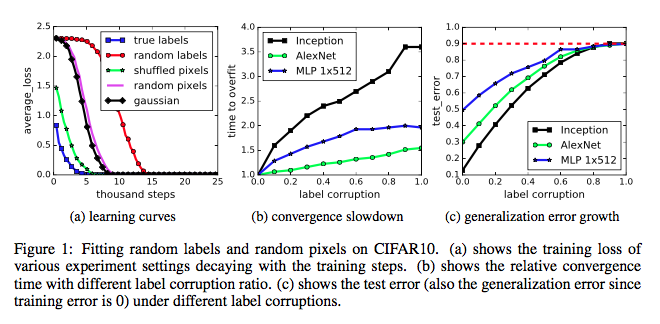

## Introduction ##
Things you should know before we proceed
* Gradient descent optimization procedures -- weight updates proportional to the gradient. Several optimizers such as Rmsprop, SGD, momentum, ADAM exist. They are all slight variations that generally only affect the convergence rate and can sometimes find a better solution.
* Optimization parameter: batch size. Some variants of optimization consider the errors on all the data available (full batch learning), some consider a (relatively) small batch (mini-batch) or only one example in each step (stochastic).


#### Introduction [continued...] ####

* Generalization error: The difference between the error on test and train datasets.

## Tricks to avoid over-fitting ##
* Explicit regularization: minimizing $l_2$ or $l_1$ norm on weights. Dropout. Input augmentation for example, adding noise to the input or random transformations over the input like random crops
* Implicit regularization: batch norm and early stopping

For further reference, see these [slides](http://vision.stanford.edu/teaching/cs231b_spring1415/slides/alexnet_tugce_kyunghee.pdf)

Note: We recognize over-fitting when the error on validation set starts increasing.  
We only care about ReLU (Rectified Linear Units) activation function for this material.


## Common Image classification datasets ##
[CIFAR10](https://www.cs.toronto.edu/~kriz/cifar.html): 60,000 images, 10 classes, 32x32 resolution, 6,000 images per class


## [Imagenet](http://cs.stanford.edu/people/karpathy/cnnembed/cnn_embed_1k.jpg) ##

1.2 million images, 1000 classes, ~ 300x300 resolution


([Image courtesy](http://cs.stanford.edu/people/karpathy/cnnembed/cnn_embed_1k.jpg))


## Popular neural nets for Image Classification ##
**AlexNet** and **Inception** are two networks that are designed for performance on the ImageNet.

AlexNet:
- 7 hidden weight layers
- 650K neurons
- 60M parameters
- 630M connections

Inception is much bigger and deeper.

For more information, consult this [blog](https://culurciello.github.io/tech/2016/06/04/nets.html)


## On Large-Batch Training For Deep Learning: Generalization Gap and Sharp Minima [1] ##
Understand why Small Batch (SB) methods generally find a better solution than Large Batch (LB) ones.


## Why not just use Small Batch methods? ##

Large batches are typically in the order of thousands and batch sizes less than 512 are considered small.

From Yann LeCun's "Efficient Backprop"[2]

> Advantages of Stochastic Learning 
>
> 1. Stochastic learning is usually much faster than batch learning.
> 2. Stochastic learning also often results in better solutions.
> 3. Stochastic learning can be used for tracking changes.

Notes: 

* It is an established fact that stochastic learning gives a better solution.
* (The 3rd advantage above:) Stochastic learning can deal with the case when the function being modelled changes with time. When we average over all the data, the changes go undetected. Online learning if "operate properly" can give good approximation results.


> Advantages of Batch Learning
>
> 1. Conditions of convergence are well understood.
> 2. Many acceleration techniques (e.g. Conjugate gradient) only operate in batch learning.
> 3. Theoretical analysis of the weight dynamics and convergence rates are simpler.

Notes:
The very reason why SGD is useful, noise, also works to the advantage of batch learning.  
The main disadvantage that is emphasized in this paper is the difficulty in parallelizing the SGD update because (1) sequential nature of the updates (2) the update step does not contain enough computation that it reaps the benefit of parallelization.  
By reducing the time per update step, it is possible to reduce the computation time since the number of update steps required in a batch learning is lesser.


## Why is Large Batch bad? ##

Although, optimization with large and small batch lead to similar performance on train set, the solution obtained by large batch suffers on the test set. 

- Possible reasons:
  * LB methods over-fit the model; <!-- .element: class="fragment" -->
  * LB methods are attracted to saddle points; <!-- .element: class="fragment" -->
  * LB methods lack the explorative properties of SB methods and tend to zoom-in on the minimizer closest to the initial point; <!-- .element: class="fragment" -->
  * SB and LB methods converge to qualitatively different minimizers with differing generalization properties. <!-- .element: class="fragment" -->
- The data presented in this paper supports the last two causes. <!-- .element: class="fragment" -->


## Guess ##

It is conjectured that the LB methods lack explorative properties and settle at a sharp minimizer which may perform well on training data, but may fail on test data.


## What are sharp and flat minimizers? ##

> A flat minimizer $\bar{x}$ is one for which the function varies slowly in a relatively large neighborhood of $\bar{x}$. In contrast, a sharp minimizer $\hat{x}$ is such that the function increases rapidly in a small neighborhood of $\hat{x }$.


## What are sharp and flat minimizers? [continued...] ##


## Targeted experiments ##

Six multi-class classification network configurations are considered.


## Targeted experiments [continued...] ##

* For LB methods, 10% of the training data is chosen as the batch size (which means the batch size varied from 5,000 on MNIST and ~72,000 on TIMIT dataset). For SB, the batch size is set to 256 for all the experiments.
* Experiments with any of the optimizers: ADAM, ADGRAD, SGD, adaQN gave similar results, all the results reported are with ADAM optimizer.


## Targeted experiments [continued...] ##


## Recognizing the problem ##


Note: 
The numbers in the table are written in "mean+standard deviation" format summarized across five trails.  
Observe that the difference between LB and SB is starker in test accuracy than in train.  


## Over-fitting is not the problem ##


Note: In both SB and LB cases, the network is trained so as not to deteriorate on validation data.


## An evidence for if the sharpness of minima is a problem ##
* The nature of minima can be visualized with something called parametric 1-D plots.
* If ${x_l}^{\ast}$ and ${x_s}^{\ast}$ are the solutions (weights) corresponding to the large and small batch methods, then the 1-D parametric plots look at the nature of all solutions in 
$\alpha\*{x_l}^{\ast}+(1-\alpha)\*{x_s}^{\ast}$. 
* $\alpha \in [-1, 2]$ for the sake of experiment. 

$\alpha$=1 corresponds to the solution of large batch and $\alpha$=0 to the small batch.


## An evidence for if the sharpness of minima is a problem [continued...] ##


Note: 
There is an interesting correlation between the table 2 and this figure that I cannot help, but notice.  
The network configurations when arranged according to the difference in test accuracy with LB and SB methods will fall into: $F_1$<$C_2$<$C_1$<$C_3$<$F_2$<$C_4$  
Now, take a look at the solid blue line in each of the figures.
$F_1$ is the most flat of all at $\alpha=1$ and $C_4$ at $\alpha=1$ is a valley with long walls on both the sides.


## Sharpness metric ##

$$\phi\_{x,f}(\epsilon, A)=\frac{(max\_{y \in C_\epsilon} f(x+Ay))-f(x)}{1+f(x)}\*100$$

* *x* is the weight matrix, *f* is a loss function that is *f(x)* is the loss corresponding to the weight *x*.
* To keep things simple, consider this: A is an identity matrix, $\epsilon$ is a parameter that defines the size of neighbourhood, $C_{\epsilon}$ is the set of all points defined by $\epsilon$

Note: 
In the paper, so as to not to be misled by the case when the maximum value of f occurs in a very small sub-space around x, experiments are reported for when *A* is an Identity matrix and for a random *nxp* matrix, where *p* is the dimension of the manifold.  
When *A* is not an identity matrix, but nxp matrix, then the points, *y* are sampled in the random manifold.
That way both the values in full space around *x* and the sub-space spanned by the random manifolds are explored.


## What does the metric say? ##

As expected, the number assigned by the metric is high in the case of LB as shown in the table below. 


## How is SB avoiding this solution? ##


Note:
* The blue lines in the plot above is the change in testing accuracy (The vertical axis to the left) as the batch size increases (X axis). 
* The strokes in red capture the change in sharpness.
* Observe the sudden fall in testing accuracy in both the plots, at around a batch size of 1500 for plot on left and 500 for plot on the right, meaning that the noise in the gradient computation is no longer enough to escape the attraction from sharp minimizer.


## How is SB avoiding this solution? [continued...] ##

Answer: Noise.
> From the results reported in the previous section[slide], it appears that noise in the gradient pushes the iterates out of the basin of attraction of sharp minimizers and encourages movement towards a flatter minimizer where noise will not cause exit from that basin


## Can we patch the LB method? ##
* **Dynamic Sampling:** Start with a small batch and increase the batch size. It is shown to work, but what's the schedule?


### Does not amount to reducing the sharpness of the solution ###
* Data augmentation: Random transformations over the images: random rotations, translations, horizontal reflections, etc.; Basically, adding noise to the weight updates.
* Conservative training: Make good use of data in a given batch before moving on to the next batch, this involves more than one update on a single batch.
* Robust training: Classical approaches search for a lowest point in the valley, while these approaches attempt to lower an $\epsilon$-disc down the loss surface. Surprisingly, this method affected neither test accuracy nor sharpness.


## Can we patch the LB method? [continued...] ##
Can we add noise to the gradients computed in LB method which will perhaps make it more explorative?
The authors answered one such question asked by a reviewer [3]
<pre>
Thank you for your review. 
We experimented with additive random Gaussian noise (both in gradients 
and in iterates), noisy labels and noisy input-data. 
However, despite significant tuning of the hyperparameters of   
the random noise, we did not observe any consistent improvements  
in testing error.  
Overall, our feeling is that this needs deeper investigation and  
that LB methods may need to be modified in a more fundamental way  
to achieve good generalization.
</pre>

Note: There is a difference between noise and intelligent guess.


## What's next? ##
* Can it be analytically proved that the LB methods generally converge to the sharp minimizers of the training functions?
* How best to patch LB methods to avoid this problem (better weights initialization, neural network architecture, optimization algorithm or regulatory means)?


#### UNDERSTANDING DEEP LEARNING REQUIRES RETHINKING GENERALIZATION (Best Paper Award ICLR 2017) [4]####
How are deep networks able to generalize so well?


## The big question ##
* The state-of-art networks that did well on CIFAR10 and ImageNet datasets when trained on the same dataset with randomized labels or pixels, converged to zero training error.
* This means that such networks have enough capacity to remember the data-points that they are trained on. 
* Yet, they do not. In spite of having a perfectly valid solution (training loss 0), the one corresponding to remembering all the data, the optimization procedure unfailingly finds a better solution (the one with low generalization error). 
  What is causing this?


## Randomization tests ##



Note:
* Average loss of training data goes to zero irrespective of the data transformations like: random labels, random/shuffled pixels.
* Results for random transformations is reported only for the case when there is no other explicit regularization.
* The results shown above are for the CIFAR10 dataset (which is smaller than Imagenet). On CIFAR10, smaller versions of the networks such as Inception, Alexnet, MLPs, that are designed for Imagenet task, are used. On Imagenet, the training error did not converge to 100%, but only 95.2 top-1 accuracy (which is still very good for million labels).
* The case of random labels take longer to converge than the case of random pixels which involves more randomization. This could be because in the case of random pixels, the images are well separated; in the case of random labels, the images are still correlated.


## Can the traditional approaches provide a generalization bound? ##
**Rademacher Complexity (RC) and VC-dimension**
$$\hat{\Re}\_n(H)=E\_{\sigma}[\sup\_{h \in H} \frac{1}{n} \sum\_{i=1}^{n}{\sigma\_ih(x\_i)}]$$
$\sigma\_1$...$\sigma\_n$ $\in$ {$\pm 1$} i.i.d. uniform random binary labels.  
* RC measures the ability of a given hypothesis space, *H*, to fit random binary labels, $\pm 1$
* Since the networks are able to fit random labels perfectly, the RC measure would close on its upper bound, $\Re(H)\approx 1$, and hence may fail to provide any reasonable generalization bound.

Note: 
* We need generalization bound to identify solutions that generalize to ones that do not.
* The existing methods that bound VC-dimension or its continuous analog, fat-shattering dimension do not seem to explain the generalization behavior.  
* The paper also mentions about weaker notions of uniform stability, but concludes that it is difficult to utilize these effectively. 
They measure the sensitivity to replacing one of the data points.

This slide basically concludes that none of the existing complexity measures can give a reasonable generalization bound.  
You can skip this slide, and still understand the rest of them.


## Are Regularizers responsible for Generalization? ##
Experimented with three commonly used regularizers
* **Data augmentation**: Transformations on the image like: random cropping, random perturbation of brightness, saturation, hue and contrast
* **Weight decay**: an $l_2$ regularizer on the weights.
* **Dropout**: randomly dropping the output of a layer with a given probability. 


## Are Regularizers responsible for Generalization? [continued...] ##


Note: The networks generalize fine with no regularizers (we all know that, though).  
The point is to rule out regularizers as "the" reason for generalization.


## Implicit Regularizers? ##
Two commonly used implicit regularizers are (a) early stopping (b) batch normalization.


Note: 
* The shaded area is what could have been gained if stopped early.
* "Although not explicitly designed for regularization, batch normalization is usually found to improve the generalization performance". The impact of batch norm is only 3-4% (figure 2b)
In later sections, they show that SGD also does implicit regularization. It is specially handled.


## Concluding remarks about regularization ##
* Explicit and implicit regularizers when properly tuned have improved the generalization performance consistently.
* However, it is unlikely that they are fundamental for generalization. 


## Expressivity of networks ##
* The existing methods to compute expressivity only consider what functions over the domain can be represented irrespective of the sample size.
* This work proves a lower bound on size of the networks that can perform on a finite sample size.
* Theorem: There exists a two-layer neural network with ReLU activations and 2n + d weights that can represent any function on a sample of size n in d dimensions.

Note: Expressivity of a network provides insight into what functions over the domain a network is capable of representing. 
It is a fancy word for model complexity.


For example, AlexNet which is trained on ImageNet (1.2 million training images) has 60M parameters and more than one layer. 
According to the theorem above, it is capable of representing any function over ImageNet including random labeling (effectively memorizing the data).

For the proof, they constructed a neural net with one hidden layer which has a width of *n*. 
Since *n* can be very large, they also provide a construction such that the network has width O(n/k) and k layers.


## Is SGD responsible for generalization? ##
* The solution obtained by SGD in the linear case is looked at, to better understand the behavior of its solution.
* In the linear case

  $$min\_{w \in \mathbb{R}^d} \frac{1}{n} \sum\_{i=1}^nloss(w^Tx\_i, y\_i)$$
* If $d\geq n$, there are several solutions. Does SGD find a generalizable solution in the face of several possible solutions?


* The updates of SGD at each step are of the form $w\_{t+1} \leftarrow w\_{t}-\eta e\_tx\_{i\_t}$. The final solution can be written as $w=X^T\alpha$. 
  This reduces to
  $$XX^T\alpha = y$$
* $XX^T$ is the kernel gram matrix.
* The equation above can be solved exactly for at least small datasets.
* The solution found by solving the equation above for MNIST and CIFAR10 dataset have an error rate (best) of 1.2% and 15% respectively.


* It can be proved that the solution obtained by SGD (or the equation) is of minimum norm. 
  That is of all the solutions that exactly fit the data, SGD will often converge to the solution with minimum norm.
  By doing so, SGD behaves like an implicit regularizer.
* **Minimum norm isn't always a good thing**: "On MNIST data, the l2-norm of the minimum norm solution with no preprocessing is approximately 220. With wavelet preprocessing, the norm jumps to 390. Yet the test error drops by a factor of 2"

Note:
* Openreview has some interesting discussion on this section [5]


## Conclusion ##
* The effective capacity of several networks is large enough to shatter the training data, and yet they do fine on test data. 
  It is still a missing piece of the puzzle as to what the agent is responsible.
* Yet to discover formal measures under which these enormous models are simple and finally explain the generalization.
* A key takeaway is that none of the regularization methods or model capacity is responsible for the generalization behavior and, perhaps, it is the dynamics of the optimization procedure that is causing this.


## A Case study ##
An implementation of the scaled-down AlexNet for CIFAR10 described in the second paper is available as a [tensorflow model](https://github.com/tensorflow/models/blob/master/slim/nets/cifarnet.py) (perhaps implemented by this team itself).

I trained this network on the true CIFAR10 dataset and with pixels randomized in CIFAR10.
The parameter configuration is as follows:
```txt
optimizer: SGD
momentum: 0.9
learning rate: 0.1
learning rate decay factor: 0.9
dropout: None
weight_decay: 0
input augmentation: None
```


## AlexNet on Randomized CIFAR10 ##
I found that the convergence on this dataset is extremely sensitive to regularization.
Failed to converge in each of the following cases:
* learning rate of 0.1 rather than the suggested 0.01
* weight decay: 0.004
* dropout: 0.5
* any bit of data augmentation

Note: My claims are to be taken with a pinch of salt. 
These are only my observations, but not tested with rigor.


### It did memorize the dataset ###


Note: This is when the model is trained on CIFAR10 with randomized labels.


In the case when I missed the first line in the image preprocessing, the loss behavior is shown in the image below.
```python
image = image/255.
image = tf.image.per_image_standardization(image)
```


Note: Just did not converge even after 300K iterations.


### Characteristics of the solution learned ###

#### Model learned on true data ####

Smoothness metric: 29.821 $\pm$ 0.250  

#### Model learned on randomized pixels ####

Smoothness metric: 263.928 $\pm$ 3.141  

Note: * The reported smoothness metric is averaged over three runs (the number to the right of this value is the standard deviation), with parameters: 100 neighbors considered in hyper-sphere given by $\epsilon$=e-3. *Cross Entropy loss* is used in the place of the function, f. 


The value assigned by the smoothness metric [1] is orders of magnitude bigger than in the case of model learned with randomized pixels. 

It is also shown in [1] that SGD updates have noise that will keep it away from such valleys. 
I strongly believe this to be one of the reasons why the solution found by SGD in the case of true data generalizes well; Because SGD cannot precisely navigate down the valley to find the solution that corresponds to over-fitting [1]. 
In the case of random pixels, since there is no better solution, SGD manages to find it (the over-fitting solution), perhaps.

Note: The implicit assumption I made here is that the smoothness metric of the solutions that corresponds to over-fitting solution on true data will have similar smoothness metric as the solution found in the case of randomized labels (the over-fit)


## Interesting remarks/critics from the audience ##
* $l\_2$ and $l\_1$ norm should be used with caution. They both penalize weights such that those that do not affect the loss much, remain low. Although, it may reduce the model complexity; It is not guaranteed that such regularizations can find a better solution. Consider the case when it is desired that some parameters are unbounded or take a finite non-zero value. In a nutshell, such weight penalties should not be used in a one-size-fits-all manner.


* When a model that has 100% accuracy on the train set, but only 84% on the test set; A model with 16% generalization error is considered an over-fit, at least for the traditional Machine Learning models. Why is that not the case here?  
 I agree that the solution with 16% generalization error may not be the best and can be improved, but it is not considered an overfit, at least not according to the authors. The authors consider over-fitting the case when the performance on test set is no better than chance. 


* Why are sharp minimizers bad for generalization?
  * There are several explanations and links provided in section 2.1 of [1].
  According to the minimum description length (MDL) theory, the models that require fewer bits to describe, generalize better. Since flat minima can be specified with lower precision, they have lower MDL.
  * An alternate explanation is provided in [6]. In [6], the authors have proposed a variant of SGD called Entropy-SGD which is specially designed to find flat minimas. The following explanation is provided.  
  If we consider a prior on the parameters, say a Gaussian prior with fixed variance, the marginal likelihood of data would be higher in the case of flatter minima. 
  $$P(x) = P(x/\theta)P(\theta)$$


## References ##

 1. [ON LARGE-BATCH TRAINING FOR DEEP LEARNING: GENERALIZATION GAP AND SHARP MINIMA](https://openreview.net/pdf?id=H1oyRlYgg)
 2. Yann LeCun's Efficient BackProp.
 3. [Discussion on Openreview for 1 above](https://openreview.net/forum?id=H1oyRlYgg&noteId=H1oyRlYgg)
 4. [UNDERSTANDING DEEP LEARNING REQUIRES RETHINKING GENERALIZATION](https://openreview.net/pdf?id=Sy8gdB9xx)
 5. [Discussion on Openreview for above](https://openreview.net/forum?id=Sy8gdB9xx&noteId=Sy8gdB9xx)
6. [ENTROPY-SGD: BIASING GRADIENT DESCENT INTO WIDE VALLEYS](https://arxiv.org/pdf/1611.01838.pdf)


## Proof of theorem (Extra slide) ##
Theorem: *There exists a two-layer neural network with ReLU activations and 2n + d weights that can represent any function on a sample of size n in d dimensions.*

Sketchy proof: For weight vector w, b $\in \mathbb{R}^n$ and a $\in \mathbb{R}^d$, consider the function to learn: c: $\mathbb{R}^n\rightarrow \mathbb{R}$

$$c(x) = \sum_{j=1}{w_j max(\langle a,x\rangle-b_j, 0)}$$

The weights from input to the layer are shared: *a*.
The activations from the layer are combined with the vector: *w*.

Note: For proof, look at [4]; I am only interested in an intuitive explanation.


Basically, the plan is to make a different number of neurons to activate (classic trick).
That is $b\_1<x\_1<...b\_n<x\_n$, which means the number of activated neurons for the input $x_i$ is i.

$x_i$s are the inputs to the first layer that is $\langle a,z\_i\rangle$.
Since *a* and *b* are both unknowns, choose a value for a and for each of the distinct values of $\langle a,z\_i\rangle$, choose the value for *$b_i$*.

Finally, we have $y=Aw$ where A is $max(\langle a,x\rangle-b_j, 0)$. 
The construction is such that A is full rank, hence *w* is solvable.

Note: The weights learned by a simple network on XOR data would show the same behavior, $b\_1<x\_1...b\_n<x\_n$; That is why I call it the classic trick. 


## Contact ##

Vihari Piratla 

IIT Bombay

viharipiratla@gmail.com
