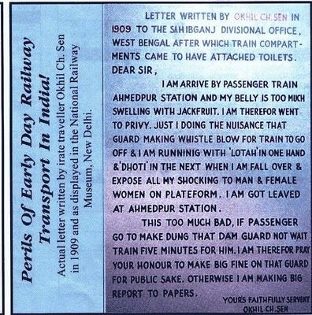

## Complaint that led to the introduction of Toilets in Indian Rail

<small>(Image under display in National Railway Museum, New Delhi)</small>

Indian Railways started its service in 1853 and introduced toilets with this complaint in 1909. 

Note: 
The person who has sent the letter is no law maker and is an ordinary citizen, but led to nation-wide impact.  
It is important that the citizens are heard to.

## Fast-forward a century
data-background-image
Online complaint filing systems are fragmented and direction less.

* [I Change My City](http://www.ichangemycity.com/)
* [Consumer Complaints Board](https://www.consumercomplaints.in/)
* [ChintalessNagarik](http://chintalessnagrik.com/online-complaint-plan-pricing/) [Quora Post by the founder](https://www.quora.com/How-well-does-in-Indian-complaint-board-forum-helps-in-solving-issues/answer/Karnav-Shah?srid=XQOZ)

* Twitter 

Note: 
We are aware of several existing portals for venting and identify several problems with them.

## Our system (Venter) and its objective

* **Support from community**: Through better organization of complaints, every complaint is seen through the lens of community of citizens with the same issue and hence reflecting the severity of the problem. 
* **Auto-generated solution**: Propose a solution for quick turn-around which may or may not be a solution, but can help remove human from the loop to some extent.
* **Ridiculously-low time to file a complaint**: We understand you are busy. With the help of several Machine Learning/Information Extraction techniques, we attempt to reduce the avaerage time to file an issue. 
* **Agencies in the loop**: The complaint resolving authorities are in the loop and are notified of issues of their concern.
