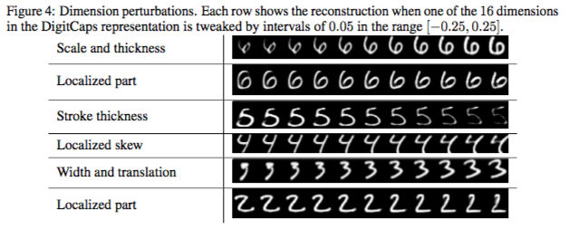

## Problem Statement (Seminar's) ##
In a nutshell, it is about demystifying/organizing deep networks.

* Deep Networks compose complex features by composing several simpler features. 
* Low level features could be of utility for several tasks; For example, edge and corner features for any image classification and identifying eyes, nose, ears etc. for face recognition/verification.


* Can the network be partitioned into several decomposable and reusable modules?
* Such modules can be reused across several tasks, thereby reduce requirement on annotated data to a certain extent and are potentially more generalizable, intelligible.


## Capsule Networks ##
Capsule is a group of neurons that specialize in recognizing an entity or part of an entity.  
Papers from this group on capsules:
* Matrix Capsules with EM routing [Under Review -- ICLR 2018]
* **Dynamic Routing Between Capsules [NIPS 2017]**
* Transforming Auto-encoders [2011]


## ConvNets ##
* Convolutional window/kernel is scanned over the input; It is parameterized by kernel size and stride.
* This is followed by a sampling/pooling layer to reduce the feature map size.
  * Max pooling replaces activations in a window with the most active one.
  * Min and average pooling with min and average activations respectively. 
* Finally all the activations are flattened and passed through fully connected layers.


## Parallels with CNNs ##
* CNN kernels/windows replaced by capsules  
* Max pooling based routing replaced by agreement based routing  
* Scalar output of neuron replaced by vector output of capsule  

Unlike CNN, spatial information is not thrown away.


## Why capsules? ## 
* More data efficient (lesser number of parameters)
* Better principled (routing vs max-pooling)
* Robust to viewpoint changes
* Does better at segmentation


## Capsules and Vector outputs ## 
* The output of a capsule is a vector of activations of all the constituent neurons.  
* Length (norm) of the vector is used as the prediction on if the entity corresponding to the capsule is present in the input.  
* A squashing function, non linear, is used akin to activation function.

$$v_j = \frac{\left\Vert s_j \right\Vert^2}{1+\left\Vert s_j \right\Vert^2}\frac{s_j}{\left\Vert s_j \right\Vert}$$

$v_j$ is the vector output and $s_j$ is its total input.


$$ s\_j = \sum\_{i}{c\_{ij} u\_{j|i}} $$

$$u\_{j|i} = W\_{ij}u\_i$$  
$u\_i$ is the vector output of capsule $i$ of the layer below.  
$W\_{ij}$ is the transformation matrix between capsule `i` in layer `l` and capsule `j` in layer `l+1`  
$c\_{ij}$ are the coupling coefficients between capsules `i` and `j`


## Case against ConvNets ## 
* Several layers of sampling (in ConvNets) will induce significant uncertainty over the spatial locations of the entity.
* ConvNets tend to recognize entities without paying heed to where it is. 
* Although, that is one strategy to make the network robust to viewpoint changes, one can benefit by capturing the spatial transformation between the entities. 


## A simple CapsNet ##
</img>

This model contains 2 convolutional and one fully connected layer.

Notes: 

This simple CapsNet performs comparably with deep ConvNets.

1. The first layer is a general convolutional layer, without any pooling.
2. Second layer is very similar to convolutional layer except that (a) squashing function instead of ReLU-like activation function (b) several conv units are grouped together and their activations emitted as vectors.
3. DigitCaps is a fully connected layer; there is routing between PrimaryCaps and DigitCaps. There is capsule for every label which assigns confidence for instantiation of image of that label in the image.


## Code is worth a thousand words! ##
[Code courtesy](https://github.com/naturomics/CapsNet-Tensorflow/blob/master/capsNet.py)
```python
   with tf.variable_scope('Conv1_layer'):
       # Conv1, [batch_size, 20, 20, 256]
       conv1 = tf.contrib.layers.conv2d(self.X, num_outputs=256,
                                             kernel_size=9, stride=1,
                                             padding='VALID')
	   assert conv1.get_shape() == [cfg.batch_size, 20, 20, 256]

    # Primary Capsules layer, return [batch_size, 1152, 8, 1]
    with tf.variable_scope('PrimaryCaps_layer'):
        primaryCaps = CapsLayer(num_outputs=32, vec_len=8, with_routing=False, layer_type='CONV')
            caps1 = primaryCaps(conv1, kernel_size=9, stride=2)
        assert caps1.get_shape() == [cfg.batch_size, 1152, 8, 1]

    # DigitCaps layer, return [batch_size, 10, 16, 1]
    with tf.variable_scope('DigitCaps_layer'):
        digitCaps = CapsLayer(num_outputs=10, vec_len=16, with_routing=True, layer_type='FC')
        self.caps2 = digitCaps(caps1)

```

Notes:
There is no pooling anywhere. 


## Dynamic Routing ##
</img>

* Note that it is repeated for `r` iterations.  
* Network capacity increases wit number of iterations by surging non-linearity.
* It is empirically found to do best with *3* iterations. 


## Dynamic Routing [continued...] ##
* Routing-by-agreement is the key contribution of the paper.
* An attempt to replace unprincipled max-pooling with a more principled method.
* Coupling between capsules in different layers is changed depending on if their predictions **agree**.
* Routing is only between capsule layers where there is vector output. 


## Margin and Regularization Loss ##

$$L_k = T_k*max(0, .9 - \left\Vert v_k \right\Vert)^2 + \lambda(1-T_k)max(0, \left\Vert v_k \right\Vert - .1)^2$$

$T_k$ is an indicator variable which is active when digit of class `k` is present.


## Reconstruction Loss ##
* Reconstruction loss is, mildly, introduced to explain all the entities in the input.
* Typically in ConvNet, all the information about spatial orientation of the features is thrown away making it impossible to reconstruct the original input. 
* This loss enforce that the pose is encoded in the representation. 

Notes:
They point out in the discussion that because CapsNet on the lines of any generative model has the disadvantage that all of the input needs to be explained. 
Which caused problems in the case of CIFAR10 where the clutter in the background is more significant than MNIST.


## Experiments ##

</img>

Inspite of baseline being a much deeper model with much larger number of parameters (35.4M) than CapsNet (10M), CapsNet did better.


## What's learned? ## 
* No convolutional unit goes unexplained especially since there is no pooling. 
* DigitCaps contains 10 16D vectors. As the vectors are separated for each class, they stay insulated of interactions from other classes. (Unlike logits in ConvNet say)


</img>

Notes:
This enables the analysis of what each dimension of each class encode. 


## Other results ##
* CapsNet learns a representation that is more robust to affine transformations. (How? More on this later)
	* 79% on affMNIST compared to 66% for the baseline.
* > Dynamic routing can be viewed as a parallel attention mechanism that allows each capsule to attend to some active capsules and ignore others in the layer below.


* On MultiMNIST dataset, where there is 80% overlap of digits, the network improves over the baseline. 
* Performance drops on CIFAR10 dataset because CapsNet like any generative model does better when the clutter can be modeled, but in CIFAR10 the clutter is much too varied.


## Conclusion ##
* ConvNets have difficulty generalizing to the novel viewpoints.
  * CapsNets by encoding spatial relationship of the part to whole which is robust to viewpoint changes can do better and are found to. (This was one of the major contributions of Transforming Auto-encoders)
* Representing an activity as a vector is much more efficient than activating a point in a large dimensional space because it avoids the binding problem.
