# Paper

[Human-level concept learning through probabilistic program induction](http://web.mit.edu/cocosci/Papers/Science-2015-Lake-1332-8.pdf)

[Supplementary](https://cims.nyu.edu/~brenden/LakeEtAl2015Science_supp.pdf)

*published in Science Magazine, 2015*

Related publication by Hinton in NIPS 2006: [Inferring Motor Programs from Images of Handwritten Digits](http://www.cs.toronto.edu/~hinton/absps/vnips.pdf)

# Motivation

1.  People can generalize easily from just a few examples while machines need to see (on the order) millions of labeled examples.
2.  Humans have a much richer representation of the learned concepts which enable explanation and imagination.

>  &#x201c;The center problem of AI is the question: What is the letter 'a'?  &#x201d;

> &#x201c;For any program to handle letterforms with the flexibility that human beings do, it would have to possess full-scale artificial intelligence &#x201d; &#x2014; Douglas Hofstadter, "Metamagical Themas: Questing For The Essence Of Mind And Pattern"

# Contribution

Bayesian Program Learning (BPL) for modelling and generating new examples on the Omniglot dataset.
Concepts represented as probabilistic programs.
	- Beats other models and human on one-shot classification
	- Does better than other models at one-shot generalisation as measured through visual turing test.

Omniglot is a dataset containing 1,623 characters from 50 writing systems.
The dataset is collected from Amazon Mechanical Turk (AMT), several hand-drawn versions of the images are collected from human subjects who draw a depicted symbol.
Resulting in a list of `<x, y, time>` triples.
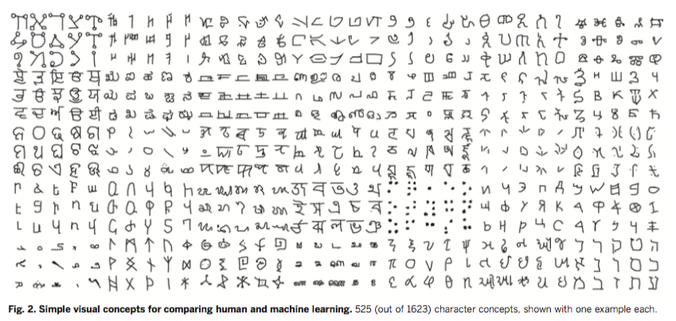

# Bayesian Program Learning (at a glance)

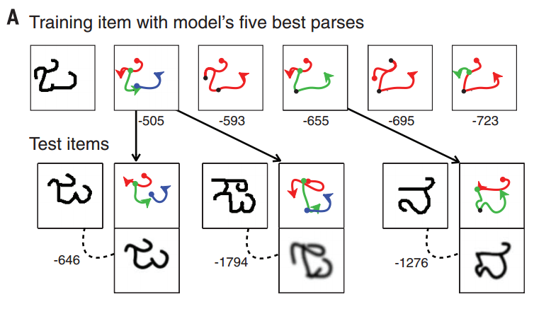

The images in the top row are the best five parses for the instance, different colors correspond to different strokes.
New instance is classified based on how well the program for a type explains the new instance. 

# Modeling Strokes

Every stroke is composed of sub-parts called primitives. 
Primitives are drawn from a library of cubic splines such as in the figure below. 

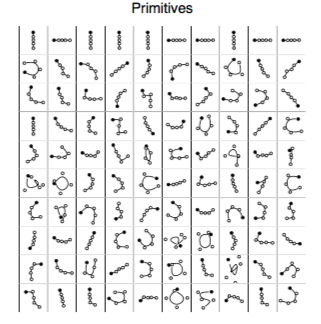

Every stroke is a list of triplets: < **z**, **x**, y >.
* **z** is a vector of integer indices that correspond to the selection over primitives.
* **x** $\in \mathbb{R}^{10}$ gives the position of each of the five control points of the spline and y denotes the scale of the shape. 
One sub-part starts where the previous sub-part ends.

# Composing strokes (relations)

The spatial relations between the strokes are modeled as one of 
-   Independent &#x2013; does not depend on the position of the previous stroke
-   Start, end &#x2013; if it starts at beginning or at the end of the previous stroke.
-   Along &#x2013; connects somewhere along the previous stroke.

# Generative Model

$P(\psi, \theta^{(1)}, \cdots, \theta^{(m)}, I^{(1)}\cdots I^{(m)}) = P(\psi)\prod_{i=1}^{m}P(I^{(m)}|\theta^{(m)})P(\theta^{(m)}|\psi)$

$\psi$ is type level model parameter.  
$\theta^{(m)}$ is the token level model parameter that capture the motor level variance in generation.  
$1\cdots m$ are the indices over _m_ samples over the type level model param

## Type Level variables

$\psi=${$\kappa, R, S$}

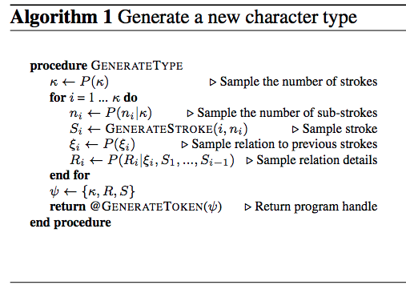</img>

## Token Level variables

$\theta^{(m)}$ = {$L^{(m)}, x^{(m)}, y^{(m)}, R^{(m)}, A^{(m)}, {\sigma_b}^{(m)}, \epsilon^{(m)}$}

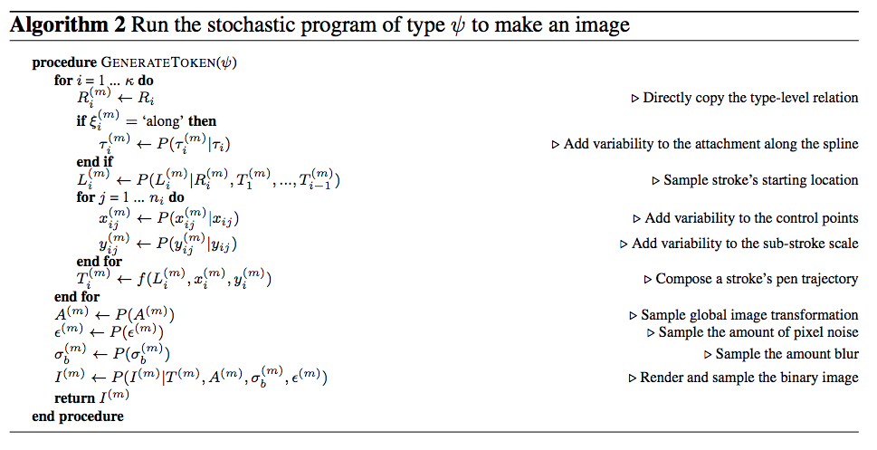

# Learning

## Learning Primitives

-   After spatially and temporally standardizing the data, 55,000 sub-parts trajectories are collected.
-   GMM with 1250 mixtures (over 30 alphabets) is used to partition the trajectories and learn primitives.

Notes: sub-parts are identified from pauses observed in the trajectories

## Learning start positions

The position of the first and the second stokes is learned by fitting a multinomial grid over the images.
An aggregated model for the subsequent strokes. 

## Learning relations and token variability

A more complicated model is fit over the 800 background images and statics are collected over these fits to compute the relational params, positional noise. 
\(\sigma_x, \sigma_y, \sigma_\tau\) are estimated from how much the shape and scale change from program that is fit on one example when used on another example.

## Global transformation

The glabal transformation (translation and rotation) is estimated simply by computing the variance of transformations over the background images.

# Inference

Inference is tricky since it requires exploration of combinatorial space over number of (sub-)parts, types, relations etc. 
MCMC is found to be slow and gets stuck in local minima.

## Character skeletons and random parses

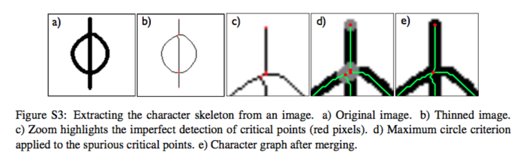
<small>Image is thinned and control points identified </small>

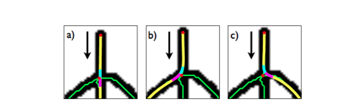
Random parses over the skeletal structure of the image, a decision needs to be taken at every fork.
The yellow ink the images above correspond to a single stroke.

The points in red are the junction points.
For random parses, an action needs to be taken at each of these red points.
$P(A) = exp(-\lambda\theta_A)$

-   Sub-strokes are identified by greedily adding, removing or replacing the pauses maximizing the likelihood of the observed trajectory.
	A decompoaition of the image into substokes is scored as follows  
	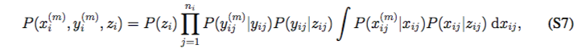
-   Once the strokes and their sub-parts are identified, K (=5) best candidate programs: $\psi$ and $\theta^{(m)}$ are identified.

# Approximate inference for one shot classification

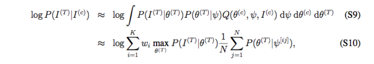

Better results are found when considering conditional from both the sides i.e. $P(I^{(c)}|I^{(t)})$ and $P(I^{(t)}|I^{(c)})$;
$I^{(c)}$ is the seen examples and $I^{(t)}$ is the new test image.

# Results

Beats human (and other deepnets) on one-shot classification task.

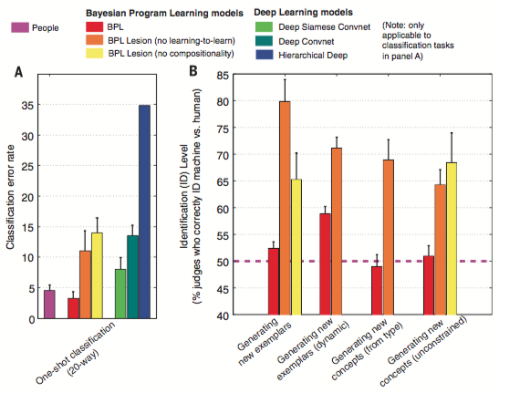

<small>Compared with lesion models that give up on either learning to learn an aspect of the model such as sub-stroke shape/scale, stroke relations or position.
The model is also compared with the case when an image is modeled with just one cubic b-spline ie. no compositionality.
</small>

## Visual Turing test
Try it [here](https://cims.nyu.edu/~brenden/supplemental/turingtests/turingtests.html)

I could only score 55% on this test.

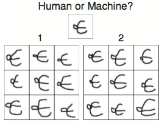</img>

<!--

<h2 class="footnotes">Footnotes: </h2>

<a id="fn.1" name="fn.1" class="footnum" href="#fnr.1">1</a> sub-parts are defined to be the trajectories between two pauses.

-->

