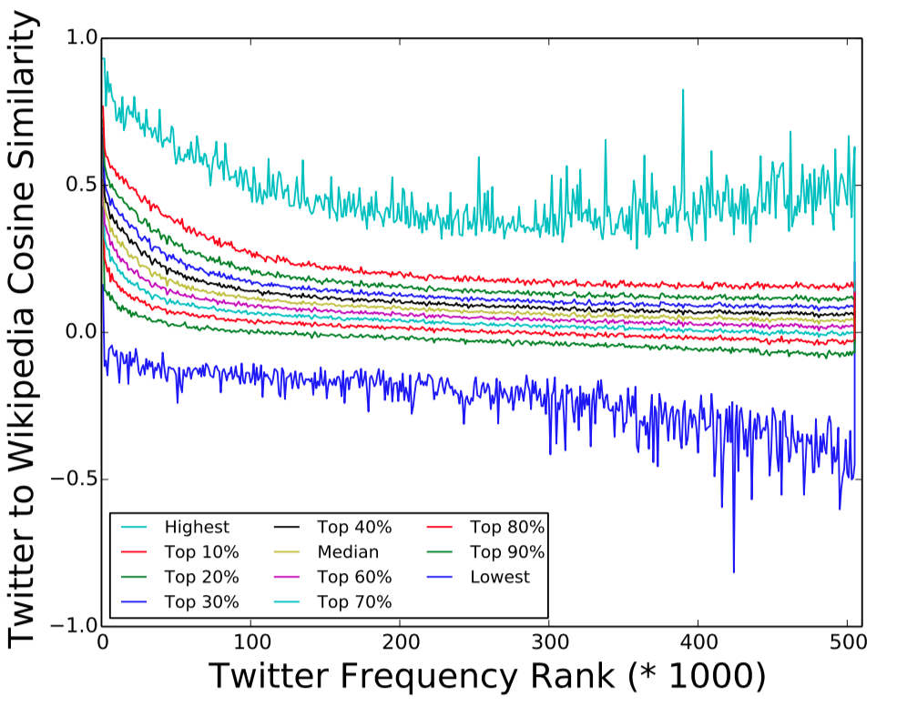
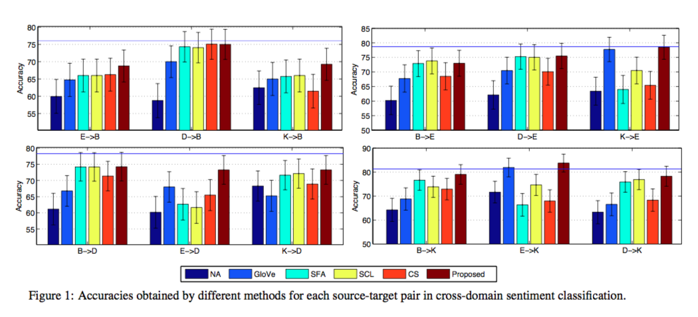
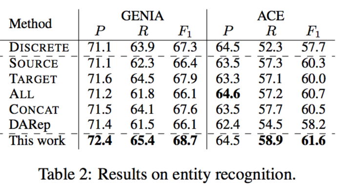

# Papers

- [(ACL 2015 short) Lexical Comparison Between Wikipedia and Twitter Corpora by Using Word Embeddings]( http://www.aclweb.org/anthology/P15-2108)
- [(ACL 2015)Unsupervised Cross-Domain Word Representation Learning](http://www.aclweb.org/anthology/P/P15/P15-1071.pdf)
- [(EMNLP 2017 short) A Simple Regularization-based Algorithm for Learning Cross-Domain Word Embeddings](http://aclweb.org/anthology/D17-1312)

# Motivation 
* An embedding of a word is a dense representation that captures the context the word appears in i.e. the meaning of the word.
* However, a word can have several meanings, a single representation vector cannot capture all possible semantics of the word.
* The problem gets worse when trying to use the representations trained on one domain in another. Because the meaning of the word in new domain can change. 

Notes: For example, Twitter vs Wikipidia 

# Lexical Comparison Between Wikipedia and Twitter Corpora by Using Word Embeddings
* The task is to detect change in the usage of a word based on similarity measure on the embeddings learned from Twitter and the Wikipedia dataset.

# Method
Assumption: *Words that are frequent across the corpus would not change their meaning.*

  * Top-k frequent words are used as pivots to learn a projection from word embedding learned on Twitter to Wikipedia and vice-versa. 
  * The learned projection matrix is used to project every word embedding into a common space. Similarity measure between words is computed in this space.
Notes: This is a recurrent assumption in all the papers I present today.

Let A = $[a_1^T, a_2^T, \dots, a_c^T]^T$ and B = $[b_1^T, b_2^T, \dots, b_c^T]^T$ where `c` is the number of words in the common vocabulary.
The ordering is based on frequency in target set.
Projection matrix `M` is learned by
	
$\min\_M \sum\_{i=1}^n{||a\_iM-b\_i||^2}$

Similarity between $a_iM$ and $b_i$

# Experiments
**Dataset**

| Corpora   | # Documents | # vocabulary |
|-----------|-------------|--------------|
| WikiPedia | 3,776,418   | 7,267,802    |
| Twitter   | 263,572,856 | 13,622,411   |

Word2vec trained on cleaned versions of these two datasets individually.

Notes: The twitter corpus is surprisingly big, the tweets are collected through streaming API of two years.

# Results

- For every word, its cosine similarity with corresponding word in Twitter is reported in the figure below. 
- The 506,000 common words in Twitter+Wikipedia are split into 506 buckets of 1000 each. 
- Pick the first word in every bucket and you get the *highest* labeled curve in the image below. 
- Pick words from 2-100 in every bucket, you get the curve corresponding to top 10%.

* It is noted that the cosine similarity is highest for the most frequent word and decreased there after as a general trend. 
* Notice the blue line, the cosine similarity plunges to less than zero very soon. This effect might have been averaged out in other level curves.

Example words whose usage is found to differ with this metric.

| Word     | Twitter Most Similar                            | Wikipedia Most Similar                                |
|----------|-------------------------------------------------|-------------------------------------------------------|
| bc       | because bcus bcuz cuz cos                       | bce macedon hellenistic euthydemus ptolemaic          |
| ill      | ll imma ima will youll                          | unwell sick frail fated bedridden                     |
| cameron  | cam nash followmecam camerons callmecam         | gillies duncan mckay mitchell bryce                   |

| Word     | Twitter Most Similar                            | Wikipedia Most Similar                                |
|----------|-------------------------------------------------|-------------------------------------------------------|
| mentions | unfollow reply respond strangerswelcomed offend | mentions mentioned mentioning reference attested      |
| miss     | misss love missss missssss imiss                | pageant pageants titlehoder titlehoders pageantopolis |
| yup      | yep yupp yeah yea yepp                          | chevak yupik gwaii tlingit nunivak                    |
| taurus   | capricorn sagittarius pisces gemini scorpio     | poniatovii scorpio subcompact sagittarius chevette    |

# Sanity check of similarity metric
In order to establish the sanity of cosine similarity in the projected space, it is qualitatively compared with a rank stability measure. 
Given two ranked lists $A\_{1:k}$, $B\_{1:k}$ RBO is defined as:

$RBO = (1-\phi)\sum\_{k=1}^{\infty}{\phi^{k-1}\frac{|A\_{1:k}\cap B\_{1:k}|}{k}}$

$\phi$ is a hyper-parameter set to .9
Notes: Decaying accumulation over *k*, the number of commons words at depth *k*

# Comments
* If there is an assumption free method and a more natural way of finding if the usage of the word has changed (Rank stability), why not just use that? Especially when it is shown by the same paper that projected similarity metric does not do anything more than rank stability measure. 
* The method is only tested on one source, target pair. 
* The target set (Twitter) is not representative of the real-world case where the target domain is generally much smaller. 

* Clearly, the assumption that high frequent words retain the meaning across domains is baseless. For example, *dog* in Venter dataset and Web have different usages, yet it is frequent in both the domains.

# (ACL 2015)Unsupervised Cross-Domain Word Representation Learning
- Drawing from the seminal work of Blitzer et.al (2009) on domain adaptation of NLP tasks, pivots are identified between the source and target domains. 
- Pivots are the features whose semantics or usage do not change across domains.
- (a) Pivot must predict the non-pivots in context (b) pivots must have the same representation across domains. 

# Method
$L(C\_S, W\_S) + L(C\_T, W\_T) + \lambda R(C\_S, C\_T)$

$R(C\_S, C\_T) = \frac{1}{2}\Sigma_{i=1}^K{||c\_S^{(i)}-c\_T^{(i)}||^2}$

$L(C\_S, W\_S) = \Sigma\_{d\in D\_S}\Sigma\_{(c, w)\in d}\Sigma\_{w^\*\sim p(w)}{max(0, 1-c\_S^Tw\_S + c\_S^Tw\_s^\*)}$

`C` and `W` denote the pivot and non-pivot words.

# (Non-)Pivot Selection
Words are assigned scores based on NPMI with the corpus and top scoring words are selected as pivots or non-pivots.  
score(x) = min(NPMI(x, S), NPMI(x, T))  
$NPMI(x, y) = log(\frac{p(x, y)}{p(x)p(y)}\frac{1}{-log(p(x, y))})$

Pivots are the common high scoring words in source and target.  
Non-pivots are high scoring words that appear only in source or target.

Notes: It is not clear what exactly NPMI(x, S) where S is the corpus mean.

# Application: Cross-domain Sentiment classification
$\psi(h) = \Sigma\_{c\in h}\Sigma\_{c'\in \theta}{\theta(c')f(c'\_S, c\_S)} + \Sigma\_{w\in h}\Sigma\_{w'\in \theta}{\theta(w')f(w'\_S, w\_T)}$

where $\theta$ is a sentiment's binary classifier trained over the source domain. $\theta(k)$ is the weight corresponding to the feature *k*. *h* is a document (from target domain) represented as bag of features (unigrams and bigrams)

# Results
Numbers on sentiment classification are consistently better.

Notes: GloVe is when the word embedding trained independently on each domain is directly used. NA is no domain adaptation. SFA, SCL and CL are non-word representation state-of-art domain adaptation methods.

# Comments
* It is not clear why the non-pivots are restricted to only the top 500 target specific words absent in the source domain. One reason could be to reduce over-fitting by computing embedding for sufficiently frequent words. 
* How does the method of transforming representation learned by Glove on pivot words to do the transformation compare?
* The explanation for not having the exact same loss form as Mikolov '13 with sigmoids is to avoid expensive computation of softmax, but its not clear how that affects the numbers.

# A Simple Regularization-based Algorithm for Learning Cross-Domain Word Embeddings

The work proposes a regularizer on the skip-gram[^1] model to discourage confident word embeddings from retraining on the tagret data.

$\mathcal{L}'\_{D\_t} = \mathcal{L}\_{D\_t}+\sum\_{w\in D\_t\cap D\_s}{\alpha\_w||w\_t-w\_s||^2}$

$\alpha\_w = \sigma(\lambda\cdot \phi(w))$

$\phi(w) = \frac{2\mathcal{F}\_{D\_s}\mathcal{F}\_{D\_t}}{\mathcal{F}\_{D\_s} + \mathcal{F}\_{D\_t}}$

$\mathcal{F}$ is a normalized frequency measure. 

[^1]: Word2vec

# Results

The word representations so computed are shown to have improved numbers on NER, sentiment classification and targeted sentiment classification. 

GENIA is a bio-medical dataset -- source is enwiki9 and target is PubMed  
ACE dataset -- enwiki9 is source and Gigaword is the target.

DARep which is supposed to do at least as good as SOURCE or TARGET happens to always fall short in performance. 

Notes: ALL is when the word embeddings are obtained from the entire text corpora and concat is when the word embedding from two domains are concatenated. DARep is Bollegala et al. (2015)
